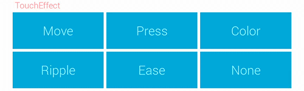
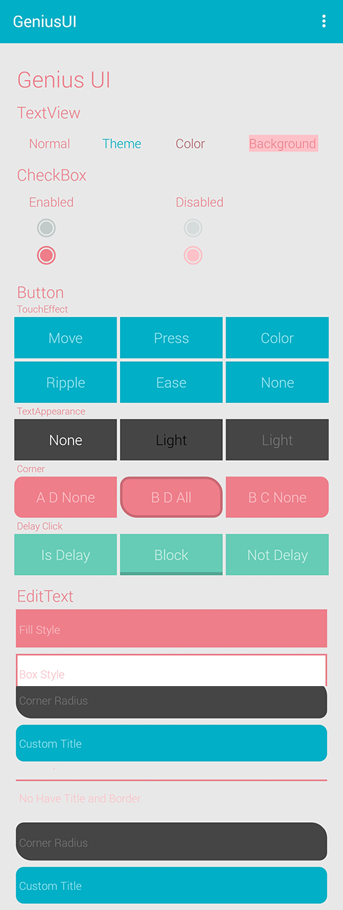
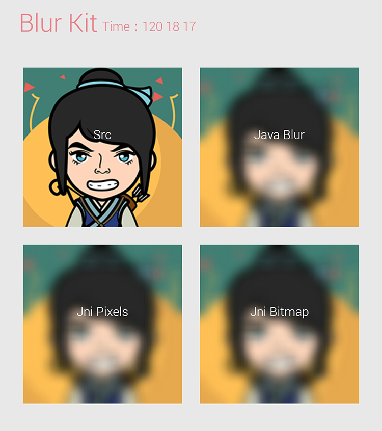
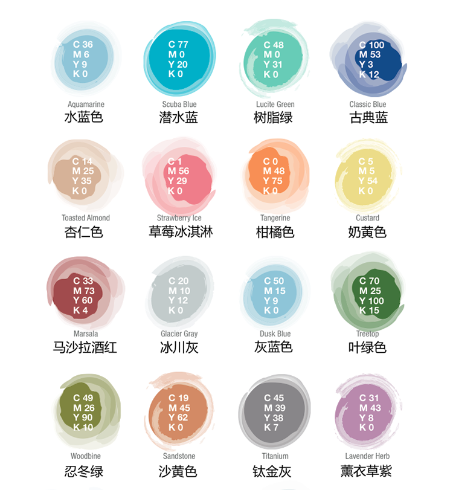

## Version 2.1.0 Guide

[`中文`](README-ZH.md) [`English`](README.md) [`Guides`](/docs/guides/GuideCatalog.md) [`Sample`](/release/sample.apk)

##What is Genius-Android?


**Genius-Android** is some of the commonly used method in **Android** collection, **Genius** library provide five basic plate :

`app`(**Ui**) `animation`(**Animation**)`widget`(**Material Widget**) `command`(**Command Line**) `net tool`(**Ping、Dns...**) `util`(**Common Method,Class**)


## Screenshots

##### GeniusUI

###### CheckBox


###### Button


###### All


##### BlurKit


##### ThemeColors



## Function modules

* `app`
  > *  `UIKit` support the child thread `synchronization` `asynchronous` switching to the main thread
  > *  `BlurKit` support `Java` `Jni` use the `StackBlur` algorithm fuzzy images

* `animation`
  > *  `TouchEffectAnimator` Can add click to control effects
  > *  `TouchEffectEnum` Move, Ripple, Ease, None

* `widget`
  > *  Fonts `opensans` `roboto`
  > *  Colors `none` `dark` `light`
  > *  Controls `GeniusButton` `GeniusCheckBox` `GeniusTextView`

* `command`
  > *  Independent service command-line work process execution
  > *  Similar to the `ProcessBuilder` operation
  > *  Intelligent correct operation, solve the operation problem
  > *  One key start and cancel the operation, control of freedom
  > *  Can be synchronous and asynchronous execution, the callback event

* `net tool`
  > *  One key `Ping` `DNS` `TelNet` `TraceRoute`
  > *  Can be controlled, can be cancelled;Don't need to care about the details
  > *  Concurrent routing tasks, can be in around 40 s testing is completed

* `util`
  > *  `AppContext` Global variables, access convenient and quick
  > *  `HashUtils` String with the file `MD5`
  > *  `Tools` `ID` `SN` Determine the device unique identifier
  > *  `Log` Such as system Log as simple to use, one key switch
  > *  `Log` Can store the log to a file, convenient analysis errors
  > *  `Log` You can add event listeners, convenient interface display log information
  > *  `FixedList` Fixed-length queue, automatic pop-up, keep the queue number


## Get library

* `Star` and `Fork` this project.
* `MavenCentral` remote import:

```gradle
// Adding to your project "build.gradle" file
dependencies {
  compile 'com.github.qiujuer:genius:2.1.0'
}

```


## Update Log 

* Version: `2.1.0`
* Date: `2015-01-14`
* Log: [`Notes`](docs/NOTES.md)


## Method of application

##### Initialization and destruction

```java
Genius.initialize(Application application);
Genius.dispose();

```


##### `widget` module

```xml
// First of all specified in the root container:
<LinearLayout
    ...
    xmlns:genius="http://schemas.android.com/apk/res-auto"/>

// The theme style: see screenshot
// Provide the font: `opensans` `roboto`
// The font size: `bold` `extrabold` `extralight` `light` `regular`

// ==================Global Attribute=================
<net.qiujuer.genius.widget.all
    ...
    genius:g_textAppearance="light"
    genius:g_fontFamily="opensans"
    genius:g_fontWeight="bold"
    genius:g_fontExtension="ttf"
    genius:g_cornerRadius="5dp"
    genius:g_borderWidth="5dp"
    genius:g_theme="@array/StrawberryIce" />

// `g_textAppearance`: Specify the font color, the default for ` none `
// `g_fontFamily`: Specify a font of two kinds of fonts
// `g_fontWeight`: The specified font weight
// `g_fontExtension`: The font extension
// `g_cornerRadius`: Arc radius, default: ` 0`
// `g_borderWidth`: Border width
// `g_theme`: Specify the subject style, 17 kinds of arbitrary choice

// ==================GeniusButton==================
<net.qiujuer.genius.widget.GeniusButton
    ...
    genius:g_touchEffect="move"
    genius:g_touchEffectColor="#ff4181ff"
    genius:g_blockButtonEffectHeight="10dp" />

// `g_touchEffect`: press, move, ease, ripple, none
// `g_touchEffectColor`: TouchEffectColor,Invalid when `g_touchEffect` is 'None'
// `g_blockButtonEffectHeight`: The button shadow height

// ==================GeniusCheckBox==================
<net.qiujuer.genius.widget.GeniusCheckBox
    ...
    genius:g_ringWidth="2dp"
    genius:g_circleRadius="22dp"
    genius:g_checked="true"
    genius:g_enabled="true" />

// `g_ringWidth`: Ring width
// `g_circleRadius`: The center of the circle radius
// `g_checked`: Is checked
// `g_enabled`: Is allow click

// ==================GeniusTextView==================
<net.qiujuer.genius.widget.GeniusTextView
    ...
    genius:g_textColor="light"
    genius:g_backgroundColor="dark"
    genius:g_customBackgroundColor="#FFFFFF" />

// `g_textColor`: Font color type
// `g_backgroundColor`: Background color type
// `g_customBackgroundColor`: Background color

```


##### `app`  module

```java
// "Runnable" implementation method "run()"
// "run()" run in the main thread, the can interface
// Synchronization to enter the main thread, waiting for the main thread processing to continue after the completion of the subprocess
UIKit.runOnMainThreadSync(Runnable runnable);
// Asynchronous into the main thread, without waiting for
UIKit.runOnMainThreadAsync(Runnable runnable);
// Synchronously But the child thread just wait for the waitTime long
// @param runnable Runnable Interface
// @param waitTime wait for the main thread run Time
// @param cancel   on the child thread cancel the runnable task
UIKit.runOnMainThreadSync(Runnable runnable, int waitTime, boolean cancel)

// "bitmap" is to be processed images
// "radius" is picture is fuzzy radius
// "canReuseInBitmap" Whether directly using the "bitmap" fuzzy,
// "false" will copy the "bitmap" to doing fuzzy
// Java blur
BlurKit.blur(Bitmap bitmap, int radius, boolean canReuseInBitmap);
// Jni blur, To the Jni is a kind of Bitmap images
BlurKit.blurNatively(Bitmap bitmap, int radius, boolean canReuseInBitmap);
// Jni blur, To the Jni is image collection "pixel"
BlurKit.blurNativelyPixels(Bitmap bitmap, int radius, boolean canReuseInBitmap);

```


##### `animation` 模块

```java
// TouchEffectAnimator Allowed to add click on special effects to your control
// Types: Press, Move, Ease, Ripple, None
public class GeniusButton extends Button {
    private TouchEffectAnimator touchEffectAnimator = null;
    // Initialize
    public void initTouchEffect(TouchEffect touchEffect) {
        touchEffectAnimator = new TouchEffectAnimator(this);
        // Set model
        touchEffectAnimator.setTouchEffect(touchEffect);
        // Set Color
        touchEffectAnimator.setEffectColor("color");
        // Set this clip radius
        touchEffectAnimator.setClipRadius(20);
    }
    // Init height width and others
    @Override
    protected void onMeasure(int widthMeasureSpec, int heightMeasureSpec) {
        super.onMeasure(widthMeasureSpec, heightMeasureSpec);
        if (touchEffectAnimator != null)
            touchEffectAnimator.onMeasure();
    }
    // Callback onDraw
    @Override
    protected void onDraw(Canvas canvas) {
        if (touchEffectAnimator != null)
            touchEffectAnimator.onDraw(canvas);
        super.onDraw(canvas);
    }
    // Callback onTouchEvent
    @Override
    public boolean onTouchEvent(MotionEvent event) {
        if (touchEffectAnimator != null)
            touchEffectAnimator.onTouchEvent(event);
        return super.onTouchEvent(event);
    }
}

```


##### `command` module

```java
// Execute the command, the background service automatic control
// The same way call way and the ProcessBuilder mass participation
// Timeout: Task timeout, optional parameters
// Params: executing params,such as: "/system/bin/ping","-c", "4", "-s", "100","www.baidu.com"
Command command = new Command(int timeout, String... params);

// Synchronous
// After the completion of the results returned directly
String result = Command.command(new Command(Command.TIMEOUT, "..."));

// Asynchronous
// Results to event callback method returns
Command command = new Command("...");
Command.command(command, new Command.CommandListener() {
    @Override
    public void onCompleted(String str) {
    }
    @Override
    public void onCancel() {
    }
    @Override
    public void onError(Exception e) {
    }
});

// To cancel a task command
Command.cancel(Command command);

// Restart the Command service
Command.restart();

// Destroy
// Using 'Genius.dispose()' method is run this destroy
Command.dispose();

```


##### `net tool` module

```java
// Ping
// Introduced to the domain name or IP
// Result: delay, packet loss
Ping ping = new Ping("www.baidu.com");
// Start
ping.start();
// Return
if (ping.getError() == NetModel.SUCCEED) {}
else {}
...
Others similarly
...

```

##### `util` module

```java
// ===================FixedList===================
// Fixed length queue
// Can specify length, using methods similar to ordinary queue
// When join the element number to a specified number elements will pop up
// Insert the tail pop-up head, tail insertion head pops up

// Initialize the maximum length of 5
FixedList<Integer> list = new FixedList<Integer>(5);

// To obtain the maximum capacity
list.getMaxSize();
// Adjust the maximum length; Narrow length will be automatically deleted when the head redundant elements
list.setMaxSize(3);

// Using List to operation
List<Integer> list1 = new FixedList<Integer>(2);


// ====================HashUtils==================
// Hash to calculate(Md5)
// String with the file can be calculated Md5 value

// Get the MD5
String hash = HashUtils.getMD5String(String str);
// Access to the file MD5
String hash = HashUtils.getMD5String(File file);


// ======================Log======================
// Log class
// Calls the method with using Android as the default method
// Can be set if the store log information
// Can copy the log information to SD card
// Can add the event callback in the main interface, the interface, real-time display the log

// Add a callback
// The callback class
Log.LogCallbackListener listener = new LogCallbackListener() {
    @Override
    public void onLogArrived(Log data) {
        ...
    }
};
// Adding
Log.addCallbackListener(listener);

// Whether Android call system Log, can control whether to display
Log.setCallLog(true);
// Is open to a file, the file number, a single file size (Mb)
// The default is stored in the application directory is /Genius/Logs
Log.setSaveLog(true, 10, 1);
// Set whether to monitor external storage inserts
// Open: insert an external device (SD), will copy the log files to external storage
// This operation depends on whether written to the file open function, not open, this method is invalid
Log.setCopyExternalStorage(true, "Test/Logs");

// Copies of internal storage log files to external storage(SD)
// This operation depends on whether written to the file open function, not open, this method is invalid
Log.copyToExternalStorage("Test/Logs");

// Set the log level
// ALL(show all)，VERBOSE to ERROR decreasing
Log.setLevel(Log.ALL);

// Add log
Log.d(TAG, "DEBUG ");


// ====================Tools====================
// Commonly used toolkit
// Are all static methods, later will continue to add

// Thread sleep
Tools.sleepIgnoreInterrupt(long time);
// Copy the files
Tools.copyFile(File source, File target);
// AndroidId
Tools.getAndroidId(Context context);
// SN Id
Tools.getSerialNumber();

```


## Permission 


```xml
    <!-- Internet permission -->
    <uses-permission android:name="android.permission.INTERNET" />
    <!-- Log file permission -->
    <uses-permission android:name="android.permission.WRITE_EXTERNAL_STORAGE" />
    <uses-permission android:name="android.permission.READ_EXTERNAL_STORAGE" />
    <!-- getDeviceId permission -->
    <uses-permission android:name="android.permission.READ_PHONE_STATE"/>
    
```


## Developer

Download the project, the project can be imported into `Android Studio`, Android Studio >= 1.0

Project which contains a library and a test project, the library can be imported into your own project use.

`Eclipse` Cannot import directly in the program, please create a project in accordance with the corresponding category replacement to their projects.


## Feedback

You in use if you have any question, please timely feedback to me, you can use the following contact information to communicate with me

* Project: [`Submit Bug or Idea`](https://github.com/qiujuer/Genius-Android/issues)
* Email: [`qiujuer@live.cn`](mailto:qiujuer@live.cn)
* QQ: `756069544`
* WeiBo: [`@qiujuer`](http://weibo.com/qiujuer)
* WebSit:[`www.qiujuer.net`](http://www.qiujuer.net)


## Giving developers

Are interested in and write a `free`, have joy, also there is sweat, I hope you like my work, but also can support it.
Of course, rich holds a money (AliPay: `qiujuer@live.cn`); No money holds personal field, thank you.


## About me

```javascript
  var info = {
    nickName  : "qiujuer",
    site : "http://www.qiujuer.net"
  }
```


License
--------

    Copyright 2014 CengaLabs.

    Licensed under the Apache License, Version 2.0 (the "License");
    you may not use this file except in compliance with the License.
    You may obtain a copy of the License at

       http://www.apache.org/licenses/LICENSE-2.0

    Unless required by applicable law or agreed to in writing, software
    distributed under the License is distributed on an "AS IS" BASIS,
    WITHOUT WARRANTIES OR CONDITIONS OF ANY KIND, either express or implied.
    See the License for the specific language governing permissions and
    limitations under the License.

