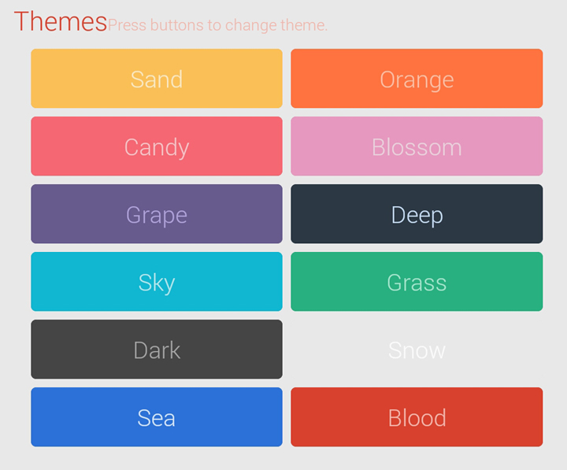

## Genius-Android是什么?

**Genius-Android** 包含了 **Android** 中一些常用的的方法集合, **Genius** 库现提供5个基本板块：

`app`（**Ui**） `material`（**控件**） `command`（**命令行**） `net tool`（**Ping、Dns...**） `util`（**常用方法,类**）

向我参考过的开源库作者致敬：

`FlatUI`，`blurring`


## Screenshots

##### MaterialButton


##### Themes


##### BlurKit


## Genius-Android 库有哪些功能？

* `app`
  > *  `ToolKit` 可在子线程`同步`切换到主线程操作
  > *  `ToolKit` 可在子线程`异步`切换到主线程操作
  > *  `BlurKit` 可在`Java`端使用`FastBlur`算法模糊图片
  > *  `BlurKit` 可在`Jni`端使用`FastBlur`算法模糊图片

* `material`
  > *  内置字体 `opensans` `roboto`
  > *  字体颜色 `none` `dark` `light`
  > *  含有五种字体粗细样式切换
  > *  含有十二种主题颜色搭配
  > *  `MaterialButton` 按钮

* `command`
  > *  独立服务进程控制进程创建销毁
  > *  智能的进程管理服务
  > *  超高的并发效率，不担心缓冲区问题
  > *  简单的操作，与ProcessBuilder操作类似
  > *  智能的监听与自杀方式，保证进程不阻塞
  > *  子进程失败后自动重新调用执行，重复10次
  > *  保证语句正常执行不疏漏
  > *  一键化的启动与取消操作，自由控制
  > *  可同步与异步方式执行，异步事件通知

* `net tool`
  > *  一键Ping操作，无需命令行，无需Root
  > *  一键DNS域名解析，可指定解析服务器
  > *  一键TelNet功能，对指定IP Port测试
  > *  一键TraceRoute，记录每一跳丢包与延时
  > *  一键的测速工具，对指定文件下载测试
  > *  控制随心，取消随心；不用关心细节问题
  > *  高并发的路由测试，可在40s左右测试完成

* `util`
  > *  全局AppContext属性获取
  > *  方便的MD5运算，包括字符串与文件
  > *  线程休眠无需多加try catch模块
  > *  获取设备标识`ID`，`SN`
  > *  `Log`：使用方式与Android日志Log一样
  > *  `Log`：一键设置是否调用系统Log类
  > *  `Log`：可一键设置日志级别，解决发布的烦恼
  > *  `Log`：可实现将日志写入文件中保存以便查看分析
  > *  `Log`：可实现将日志一键拷贝到外部存储设备中
  > *  `Log`：可添加事件监听，方便界面显示日志信息
  > *  `FixedList`：定长队列，自动弹出，保持队列数量


## 获取库

* `Star` 和 `Fork` 本项目；这样方便获取以后更新内容。
* `release` 文件夹中的 `*.jar` 或者 `*.aar` 文件可以直接导入到自己项目中。
  *  `*.jar` 无法使用控件资源，如字体和 `R..`。
  *  `*.aar` 能使用所有的类和控件以及字体等。
  *  `*.aar` 本地引入方法：
* `Eclipse` [完全导入使用方法详解](docs/EclipseImport.md)
* `Android Studio` :
  *  `*.aar` 本地导入方法：
  
  ```gradle
  // 需先拷贝 "genius_0.9.0.aar" 到 "libs" 目录
  android {
      repositories {
          flatDir { dirs 'libs' }
      }
  }
  dependencies {
      compile (name:'genius_0.9.0', ext:'aar')
  }

  ```

  *  `*.aar` `MavenCentral`远程导入：
  
  ```gradle
  // 在项目 "build.gradle" 中添加
  // 无需拷贝任何文件，等待联网更新完成即可使用
  dependencies {
      compile 'com.github.qiujuer:genius:0.9.0'
  }

  ```


## 更新日志

* 版本：0.9.0
* 日期：2014-11-26 22:40
* 日志：[更新日志](docs/NOTES.md)


## 使用方法

##### 初始化与销毁

```java
// Command 使用模块必须初始化
// Log 类如进行存储则需要初始化
// 只使用控件与 net tool 模块可不初始化
Genius.initialize(Application application);
Genius.dispose();

```


##### `app` 模块

```java
// "Runnable" 类实现其中 "run()" 方法
// "run()" 运行在主线程中，可在其中进行界面操作
// 同步进入主线程,等待主线程处理完成后继续执行子线程
ToolKit.runOnMainThreadSync(Runnable runnable);
// 异步进入主线程,无需等待
ToolKit.runOnMainThreadAsync(Runnable runnable);

// "bitmap" 待处理的图片
// "radius" 图片模糊半径
// "canReuseInBitmap" 是否直接使用 "bitmap" 中进行模糊,
// "false" 情况下将拷贝 "bitmap" 的副本进行模糊
// 在"Java"中实现图片模糊
BlurKit.blur(Bitmap bitmap, int radius, boolean canReuseInBitmap);
// 在"Jni"中实现图片模糊,传给"Jni"的是图片类"Bitmap"
BlurKit.blurNatively(Bitmap bitmap, int radius, boolean canReuseInBitmap);
// 在"Jni"中实现图片模糊,传给"Jni"的是图片 "像素集合"
BlurKit.blurNativelyPixels(Bitmap bitmap, int radius, boolean canReuseInBitmap);

```


##### `material` 模块

```xml
// 首先需要在根容器中指定：
<LinearLayout
    ...
    xmlns:material="http://schemas.android.com/apk/res-auto"/>

// 提供12种主题样式，见截图
// 提供2种字体：`opensans` `roboto`
// 字体粗细：`bold` `extrabold` `extralight` `light` `regular`

// ==================MaterialButton==================
<net.qiujuer.genius.material.MaterialButton
    ...
    material:gm_textAppearance="light"
    material:gm_fontFamily="opensans"
    material:gm_fontWeight="bold"
    material:gm_isMaterial="true"
    material:gm_isAutoMove="true"
    material:gm_theme="@array/grass" />

// `gm_textAppearance`: 指定字体颜色，默认为 `none`
// `gm_fontFamily`: 指定两种字体中的一种字体
// `gm_fontWeight`: 指定字体粗细
// `gm_isMaterial`: 是否打开 Material 动画，默认 `true`
// `gm_isAutoMove`: 动画是否自动移动到中心，默认 `true`
// 开启后动画将不会原地扩散，点击处 `XY` 坐标将向中心靠拢
// `gm_theme`: 指定主题样式，12种任意选

```


##### `command` 模块

```java
// 执行命令，后台服务自动控制
// 调用方式与ProcessBuilder传参方式一样
// 同步方式
// 完成后结果直接返回
Command command = new Command("/system/bin/ping",
        "-c", "4", "-s", "100",
        "www.baidu.com");
String res = Command.command(command);
Log.i(TAG, "Ping 测试结果：" + res);

// 异步方式
// 结果以事件回调方式返回
Command command = new Command("/system/bin/ping",
        "-c", "4", "-s", "100",
        "www.baidu.com");
Command.command(command, new Command.CommandListener() {
    @Override
    public void onCompleted(String str) {
        Log.i(TAG, "onCompleted：\n" + str);
    }
    @Override
    public void onCancel() {
        Log.i(TAG, "onCancel");
    }
    @Override
    public void onError() {
        Log.i(TAG, "onError");
    }
});

// 取消一个命令任务
Command.cancel(Command command);

// 销毁
// 可调用 ‘Genius.dispose()’ 方法统一销毁
Command.dispose();

```


##### `net tool` 模块

```java
// Ping
// 传入域名或者IP
// 结果：是否执行成功、延时、丢包
Ping ping = new Ping("www.baidu.com");
// 开始
ping.start();
if (ping.getError() != NetModel.SUCCEED) {
    Log.i("异常");
} else {
    Log.i(TAG,ping.toString());
}

// DNS
// 传入域名 + 服务器地址
// 结果：是否执行成功、延时、Ip地址集合
DnsResolve dnsResolve = new DnsResolve("www.baidu.com");
// 开始
dnsResolve.start();
if (dnsResolve.getError() != NetModel.SUCCEED) {
    Log.i("异常");
} else {
    Log.i(TAG,dnsResolve.toString());
}
...
其他的类似
...

```

##### `util` 模块

```java
// ===================FixedList===================
// 固定长度队列
// 可指定长度，使用方法与普通队列类似
// 当加入元素数量达到指定数量时将弹出元素
// 头部插入尾部弹出，尾部插入头部弹出

// 初始化最大长度为5
FixedList<Integer> list = new FixedList<Integer>(5);
// 使用Queue方法添加元素
list.offer(0);
// 使用List方法添加元素,两种方式操作是一样
list.add(1);
// 末尾插入元素与add一样
list.addLast(1);
// 从头部插入，默认删除尾部超出元素
list.addFirst(19);
// 添加一个列表
list.addAll(new ArrayList<Integer>());

// 获取最大容量
list.getMaxSize();
// 调整最大长度；缩小长度时将自动删除头部多余元素
list.setMaxSize(3);

// 采用poll方式弹出元素
int i = list.poll();
// remove 与 poll 类似，不过不返回删除元素，仅删除一个元素
list.remove();
// 清空操作
list.clear();

// 可使用List操作
List<Integer> list1 = new FixedList<Integer>(2);
list1.add(1);
list1.clear();


// ====================HashUtils==================
// 哈希计算（Md5）
// 可计算字符串与文件Md5值

// 获取字符串MD5
String hash = HashUtils.getStringMd5(String str);
// 获取文件MD5
String hash = HashUtils.getFileMd5(File file);


// ======================Log======================
// 日志类
// 调用方法与使用Android默认方法一样
// 可设置其是否存储日志信息
// 可拷贝日志信息到SD卡
// 可在主界面添加事件回调，界面实时显示日志

// 添加回调
// 回调类
Log.LogCallbackListener listener = new LogCallbackListener() {
    @Override
    public void onLogArrived(Log data) {
        //日志来了
    }
};
// 添加
Log.addCallbackListener(listener);

// 是否调用系统Android Log，可控制是否显示
Log.setCallLog(true);
// 是否开启写入文件，文件数量，单个文件大小（Mb）
// 默认存储在程序目录/Genius/Logs
Log.setSaveLog(true, 10, 1);
// 设置是否监听外部存储插入操作
// 开启：插入外部设备（SD）时，将拷贝日志文件到外部存储
// 此操作依赖于是否开启写入文件功能，未开启则此方法无效
Log.setCopyExternalStorage(true, "Test/Logs");

// 拷贝内部存储的日志文件到外部存储（SD）
// 此操作依赖于是否开启写入文件功能，未开启则此方法无效
Log.copyToExternalStorage("Test/Logs");

// 设置日志等级
// ALL(全部显示)，VERBOSE到ERROR依次递减
Log.setLevel(Log.ALL);
Log.setLevel(Log.INFO);

// 添加日志
Log.v(TAG, "日志 VERBOSE ");
Log.d(TAG, "日志 DEBUG ");
Log.i(TAG, "日志 INFO ");
Log.w(TAG, "日志 WARN ");
Log.e(TAG, "日志 ERROR ");


// ====================ToolUtils====================
// 常用工具包
// 全部为静态方法，以后会持续添加完善

// 休眠
ToolUtils.sleepIgnoreInterrupt(long time);
// 拷贝文件
ToolUtils.copyFile(File source, File target);
// AndroidId
ToolUtils.getAndroidId(Context context);
// SN编号
ToolUtils.getSerialNumber();

```


## 配置权限

```xml
    <!-- 网络 权限 -->
    <uses-permission android:name="android.permission.INTERNET" />
    <!-- 日志写文件 权限 -->
    <uses-permission android:name="android.permission.WRITE_EXTERNAL_STORAGE" />
    <uses-permission android:name="android.permission.READ_EXTERNAL_STORAGE" />
    <!-- getDeviceId 权限 -->
    <uses-permission android:name="android.permission.READ_PHONE_STATE"/>
    
```


## 你是开发者

下载本项目,项目可导入到 `Android Studio`，Android Studio >= 1.0 RC 1

项目里边含有一个库以及一个测试项目，可将库导入到自己的项目中使用。

'Eclipse' 中无法直接导入项目，请先建立一个项目按照对应目录替换到自己项目中。


## 反馈

在使用中有任何问题，欢迎能及时反馈给我，可以用以下联系方式跟我交流

* 项目：[提交Bug或想法](https://github.com/qiujuer/Genius-Android/issues)
* 邮件：[qiujuer@live.cn](mailto:qiujuer@live.cn)
* QQ： 756069544
* Weibo： [@qiujuer](http://weibo.com/qiujuer)
* 网站：[www.qiujuer.net](http://www.qiujuer.net)


## 捐助开发者

在兴趣的驱动下,写一个`免费`的东西，有欣喜，也还有汗水，希望你喜欢我的作品，同时也能支持一下。
当然，有钱捧个钱场（支付宝: `qiujuer@live.cn` ）；没钱捧个人场，谢谢各位。


## 关于我

```javascript
  var info = {
    nickName  : "qiujuer",
    site : "http://www.qiujuer.net"
  }
```


License
--------

    Copyright 2014 CengaLabs.

    Licensed under the Apache License, Version 2.0 (the "License");
    you may not use this file except in compliance with the License.
    You may obtain a copy of the License at

       http://www.apache.org/licenses/LICENSE-2.0

    Unless required by applicable law or agreed to in writing, software
    distributed under the License is distributed on an "AS IS" BASIS,
    WITHOUT WARRANTIES OR CONDITIONS OF ANY KIND, either express or implied.
    See the License for the specific language governing permissions and
    limitations under the License.

