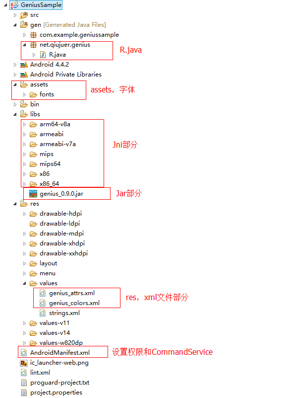

# Eclipse Import

## 为什么要写这份文档？

在使用中，我经常遇到有朋友问我， **Eclipse** 导入后怎么不能使用控件的问题；在这里我只能说抱歉了！

如果在 **Android Studio** 中只需要导入本地 `aar` 或者采用远程的方式，一行代码就能引入整个包，包含全部的功能；甚至不需要自己写权限和配置。

是的的确是这样，这是因为 `aar` 包中包含了 `Jar,jni,aidl,AndroidManifest,assets,res,R.java` 这些是一个完整的 **Library** .

而在**Eclipse**中通常引入一个包都是导入 `Jar` 就算完事儿了；虽然在 Jar 中包含了大部分的代码，但是如果遇到需要资源的情况就无能为力了；所以要使用控件就必须自己导入其他部分。


## Jar

这个步骤我相信，没有朋友不会的吧？
简单的说，拷贝 **Jar** 文件到 **Eclipse** 的项目 `Libs` 文件夹下。
然后在项目中包含进去就OK。

在引入了 **Jar** 的情况下，可以使用完整的 `Util` 包中的方法，以及 `App` 包中的 `ToolKit` 类。


## Jni

这个的导入其实与 **Jar** 相似，在这里我生成了各个平台的 `so` 文件，你可以拷贝对应平台文件夹或者拷贝项目中完整的 `release\eclipse\libs` 文件夹到你自己项目的 `libs` 中。

这个拷贝进去就算Ok，不用在项目中设置什么，唯一保证的就是不改变名称；完全拷贝。
在引入了 `Jni so` 文件后，你现在可以使用 `App` 包中的 `BlurKit` 类来模糊你的图片了，当然没有导入的情况下，你也是可以使用 `BlurKit` 中的 `Java` 方法来模糊你的图片操作的。


## aidl

这个是用于使用 `Command` 包所必需的接口。在 `Command` 中是采用的独立进程模式所以需要使用 `aidl` 接口来交互数据。
不过这个无需多此一举的配置什么，因为其接口已经打包到 `Jar` 中了；如果你实在是要配置：
* 那么请在你的项目中建立 `aidl` 
* 并在其下建立包：`net.qiujuer.genius.command`
* 然后在此包下建立文件 ：`ICommandInterface.aidl`
* 最后写入代码：

 ```java
  // ICommandInterface.aidl
  package net.qiujuer.genius.command;

  // Declare any non-default types here with import statements
  interface ICommandInterface {
     String command(String id, String params);
     void cancel(String id);
     void dispose();
     int getTaskCount();
  }   
 ```

此时你还不能使用 `Command` 模块，因为你最差的是 `CommandService` 服务的配置。


## AndroidManifest

在这一步你需要打开你的项目 `AndroidManifest` 文件：
##### 权限

```xml
    <!-- 网络 权限 -->
    <uses-permission android:name="android.permission.INTERNET" />
    <!-- 日志写文件 权限 -->
    <uses-permission android:name="android.permission.WRITE_EXTERNAL_STORAGE" />
    <uses-permission android:name="android.permission.READ_EXTERNAL_STORAGE" />
    <!-- getDeviceId 权限 -->
    <uses-permission android:name="android.permission.READ_PHONE_STATE"/>
    
```

##### CommandService

```xml
    <application android:allowBackup="true">
        <service
            android:name="net.qiujuer.genius.command.CommandService"
            android:enabled="true"
            android:exported="false"
            android:process="net.qiujuer.genius.command.CommandService">
            <intent-filter>
                <action android:name="net.qiujuer.genius.command.ICommandInterface" />
            </intent-filter>
        </service>
    </application>

```

经过以上两步后你现在能使用 `Command` 与 `net tool` 模块了。


## assets

这一步中，你需要拷贝项目根目录 `release/eclipse/assets` 中的字体文件到你自己项目中的 `assets` 文件夹中。
这是为后面支持 `material` 模块中控件的字体属性做准备。


## res

在这一步中，你需要拷贝项目根目录 `release/eclipse/res/values` 中的 `xml` 文件到你自己项目中的 `res/value` 文件夹中。
这是为后面支持 `material` 模块中控件的颜色以及属性的配置文件。


## R.java

这是最后一步了，很多人前面都完成了，但是唯独这一步没有做，导致使用控件的时候说 `属性` 加载失败。
在这一步中，你需要这样操作：
* 在你的项目中找到 `gen` 目录
* 在其下建立包： `net.qiujuer.genius`
* 拷贝项目根目录 `release/eclipse/R.java` 文件到所建立的包中。


到这里你的项目能正常使用所有板块了，包括控件板块。当然你或许需要刷新一下你的项目。


## Picture




## 关于我

```javascript
  var info = {
    nickName  : "qiujuer",
    site : "http://www.qiujuer.net"
  }
```


License
--------

    Copyright 2014 CengaLabs.

    Licensed under the Apache License, Version 2.0 (the "License");
    you may not use this file except in compliance with the License.
    You may obtain a copy of the License at

       http://www.apache.org/licenses/LICENSE-2.0

    Unless required by applicable law or agreed to in writing, software
    distributed under the License is distributed on an "AS IS" BASIS,
    WITHOUT WARRANTIES OR CONDITIONS OF ANY KIND, either express or implied.
    See the License for the specific language governing permissions and
    limitations under the License.

