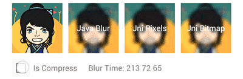

### Blur Module


// "bitmap" is to be processed images
// "radius" is picture is fuzzy radius
// "canReuseInBitmap" Whether directly using the "bitmap" fuzzy,
// "false" will copy the "bitmap" to doing fuzzy
// Java blur
BlurKit.blur(Bitmap bitmap, int radius, boolean canReuseInBitmap);
// Jni blur, To the Jni is a kind of Bitmap images
BlurKit.blurNatively(Bitmap bitmap, int radius, boolean canReuseInBitmap);
// Jni blur, To the Jni is image collection "pixel"
BlurKit.blurNativelyPixels(Bitmap bitmap, int radius, boolean canReuseInBitmap);
