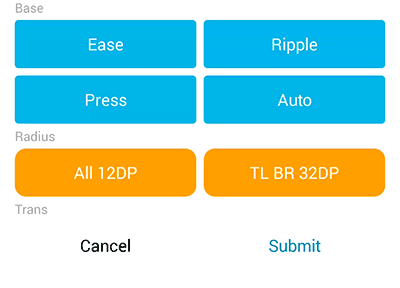
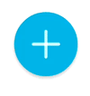
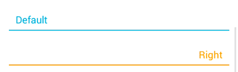
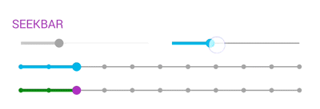
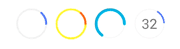

### Ui Module

This module provide same plate :

* `widget` include:

    * `TextView` quick set boder and boder
    * `Button` have touch press button
    * `FloatActionButton` have shadow button
    * `CheckBox` have click animation
    * `EditText` a MD line edit    
    * `ImageView` the imageview support touch press
    * `SeekBar` have move popup view seekbar
    * `Loading` loading progress widget
    
* `drawable` This is widget drawable and same abs class.
* `ui kit` It have font, color, attr and size convert.

### First 


// First of all specified in the root container:
<YourLayout
    ...
    xmlns:app="http://schemas.android.com/apk/res-auto"/>


### Widget 

#### TextView 


<net.qiujuer.genius.ui.widget.TextView
    ...
    android:text="Border TB"
    app:gFont="roboto.ttf"
    app:gBorder="top|bottom"
    app:gBorderColor="@color/teal_500"
    app:gBorderSize="1dp" />


* `gFont`: Set text font file name, the path's **"assets\fonts\roboto.ttf"**.
* `gBorder`: Set show border, you can set: `all`, `top`, `top|bottom`
    * **all** 
    * **left**, **top**, **right**, **bottom**.
* `gBorderColor`: Set border color, you can set: `@color/teal_500` or `#ff000000`.
* `gBorderSize`: Set border size, the unit is **dp**.

#### Button 


 <net.qiujuer.genius.ui.widget.Button
    ...
    android:background="@drawable/g_button_background"
    app:gFont="roboto.ttf"
    app:gTouchColor="@color/black_alpha_224"
    app:gTouchEffect="auto"
    app:gTouchCornerRadius="@dimen/lay_12"
    app:gTouchCornerRadiusTL="@dimen/lay_16"
    app:gTouchCornerRadiusTR="@dimen/lay_16"
    app:gTouchCornerRadiusBL="@dimen/lay_16"
    app:gTouchCornerRadiusBR="@dimen/lay_16"
    app:gTouchDurationRate="0.7" />


* `gFont`: See textview xml.
* `gTouchColor`: Set the touch press color, you can set: `@color/black_alpha_64` or `#80000000`.
* `gTouchEffect`: Set the touch press type, include:
    * **none** Not have touch effect.
    * **auto** This effect is default by MD, spread from your touch point.
    * **ease** This is Gradually fade effect.
    * **press** The spread effect from center.
    * **ripple** This is ripple effect.
* `gTouchCornerRadius`: Set the touch effect edge corner radius, this is set four corners.
* `gTouchCornerRadiusTL`: Set the corner radius between **top** and **left**.
* `gTouchCornerRadiusTR`: Set the corner radius between **top** and **right**.
* `gTouchCornerRadiusBL`: Set the corner radius between **bottom** and **left**.
* `gTouchCornerRadiusBR`: Set the corner radius between **bottom** and **right**.
 
    > In this, if you set **gTouchCornerRadius="12dp"** and **gTouchCornerRadiusTL="16dp"**,  
    > The four corners of the rectangle are 16, 12, 12, 12, respectively.
* `gTouchDurationRate`: Set touch press speed. 
If need **fast** you can set `0.0~1.0`; if you need **slow**, you can set `1~10`
 
    > Default **1.0**, EnterDuration=**280ms**, ExitDuration=**160ms**
    
    
    
#### FloatActionButton 


<net.qiujuer.genius.ui.widget.FloatActionButton
    ... 
    android:id="@+id/action_add"    
    app:gBackgroundColor="@color/cyan_500"
    app:gTouchColor="@color/black_alpha_64"/>


* `gBackgroundColor`: If you want change bg color, you need use it. you can set: `@color/cyan_500` or `#aa000000`.
* `gTouchColor`: Set the touch press color, you can set: `@color/black_alpha_64` or `#80000000`.

You can add create drawable in the src by java:


private void initFloatActionButton() {
    final float density = getResources().getDisplayMetrics().density;
    FloatActionButton addButton = (FloatActionButton) findViewById(R.id.action_add);
    AddLineShape lineShape = new AddLineShape();
    ShapeDrawable drawable = new ShapeDrawable(lineShape);
    Paint paint = drawable.getPaint();
    paint.setStyle(Paint.Style.STROKE);
    paint.setAntiAlias(true);
    paint.setDither(true);
    paint.setColor(0xc0ffffff);
    paint.setStrokeCap(Paint.Cap.ROUND);
    paint.setStrokeWidth(2 * density);
    drawable.setIntrinsicWidth(100);
    drawable.setIntrinsicHeight(100);
    addButton.setImageDrawable(drawable);
}


The **AddLineShape** in [this](https://github.com/qiujuer/Genius-Android/blob/master/caprice/sample/src/main/java/net/qiujuer/sample/genius/drawable/AddLineShape.java).

    
#### CheckBox

 

<net.qiujuer.genius.ui.widget.CheckBox
    ...
    android:background="@null"
    app:gFont="roboto.ttf"
    app:gBorderSize="1dp"
    app:gIntervalSize="2dp"
    app:gMarkSize="22dp"
    app:gMarkColor="@color/m_check_box" />


* `gFont`: See textview xml.
* `gBorderSize`: Set ring drawable size.
* `gIntervalSize`: Set ring to circle interval size.
* `gMarkSize`: Set mark drawable size; if you not set, the size is **Math.min(width, hight)**.
* `gMarkColor`: Set mark color, the color allow set **ColorStateList**.
    * `#ff000000`
    * `@color/black_alpha_64`
    * `color drawable:`

<selector xmlns:android="http://schemas.android.com/apk/res/android">
    <item android:color="@color/grey_400" android:state_checked="false" android:state_enabled="true" />
    <item android:color="@color/grey_300" android:state_checked="false" android:state_enabled="false" />
    <item android:color="@color/cyan_500" android:state_checked="true" android:state_enabled="true" />
    <item android:color="@color/cyan_300" android:state_checked="true" android:state_enabled="false" />
</selector>


#### EditText

 

<net.qiujuer.genius.ui.widget.EditText
    ...
    app:gFont="roboto.ttf"
    app:gHintTitle="slide"
    app:gHintTitlePaddingBottom="2dp"
    app:gHintTitlePaddingLeft="0dp"
    app:gHintTitlePaddingRight="0dp"
    app:gHintTitlePaddingTop="0dp"
    app:gHintTitleTextSize="14sp"
    app:gLineColor="@color/m_edit_view_line"
    app:gLineSize="2dp" />


* `gFont`: See textview xml.
* `gHintTitle`: Set Hint title style type:
    * **none** Not hava hint.
    * **slide** Slide show title, this is Deafault.
* `gHintTitlePaddingBottom`: Set title padding bottom.
* `gHintTitlePaddingLeft`: Set title padding left, if align left, default by TextView padding left.
* `gHintTitlePaddingRight`: Set title padding right, if align right, default by TextView padding right.
* `gHintTitlePaddingTop`: Set title padding top.
* `gHintTitleTextSize`: Set title text size.
* `gLineColor`: Set EditText bottom line color.
* `gLineSize`: Set EditText bottom line size.

#### ImageView
 

 <net.qiujuer.genius.ui.widget.ImageView
    ...
    app:gTouchColor="@color/black_alpha_224"
    app:gTouchEffect="auto"
    app:gTouchCornerRadius="@dimen/lay_12"
    app:gTouchCornerRadiusTL="@dimen/lay_16"
    app:gTouchCornerRadiusTR="@dimen/lay_16"
    app:gTouchCornerRadiusBL="@dimen/lay_16"
    app:gTouchCornerRadiusBR="@dimen/lay_16"
    app:gTouchDurationRate="0.7" />


* `gTouchColor`: Set the touch press color, you can set: `@color/black_alpha_64` or `#80000000`.
* `gTouchEffect`: Set the touch press type, see **Button** attr, default none.
* `gTouchCornerRadius`: Set the touch effect edge corner radius, this is set four corners.
* `gTouchCornerRadiusTL`: Set the corner radius between **top** and **left**.
* `gTouchCornerRadiusTR`: Set the corner radius between **top** and **right**.
* `gTouchCornerRadiusBL`: Set the corner radius between **bottom** and **left**.
* `gTouchCornerRadiusBR`: Set the corner radius between **bottom** and **right**.
* `gTouchDurationRate`: Set touch press speed. you must `>0.0`, see **Button** attr.

#### SeekBar


 <net.qiujuer.genius.ui.widget.SeekBar
    ...
    app:gFont="roboto.ttf"
    app:gMax="10"
    app:gMin="0"
    app:gValue="2" 
    
    app:gIndicator="auto"
    app:gIndicatorTextPadding="2dp"
    app:gIndicatorBackgroundColor="@color/m_seek_bar_indicator_bg"
    app:gIndicatorFormatter="(∩_∩)%d"
    app:gIndicatorSeparation="14dp"
    app:gIndicatorTextAppearance="@style/Genius.Widget.BalloonMarker.TextAppearance"
    
    app:gRippleColor="@color/m_seek_bar_ripple"
    app:gScrubberColor="@color/m_seek_bar_scrubber"
    app:gScrubberStroke="4dp"
    app:gThumbColor="@color/m_seek_bar_thumb"
    app:gThumbSize="6dp"
    app:gTickSize="3dp"
    app:gTouchSize="12dp"
    app:gTrackColor="@color/grey_500"
    app:gTrackStroke="2dp"
    
    app:gMirrorForRtl="true"
    app:gAllowTrackClickToDrag="true"/>


* `gFont`:  See textview xml.
* `gMax`: Set seekbar max value, the value must greater than `gMin` value.
* `gMin`: Set seekbar min value, the value must less than `gMax` value.
* `gValue`: Set the progress value, the value between `gMin` and `gMax`.
* `gIndicator`: This's seekbar popup view, set the type.
    * `none` not show popup view.
    * `auto` if user move progress the view will show.
    * `always` the view always show, **in development**.
* `gIndicatorTextPadding`: The popup text view padding.
* `gIndicatorBackgroundColor`: The popup view background.
* `gIndicatorFormatter`: The popup textview formatter, eg: `(∩_∩)%d`, `-_-%d` or `^%d^`.
* `gIndicatorSeparation`: The popup float height.
* `gIndicatorTextAppearance`: If you need custom textview style, you can set it. This's style xml.




* `gThumbColor`: Set seekbar thumb color.
* `gThumbSize`: Set seekbar thumb **diameter** size.
* `gTouchSize`: On state is active will show a circle, the circle will follow finger movement. This's set the circle **diameter** size.
* `gRippleColor`: On you touch the thumb, seekbar will to active state and ripple a circle. This's set ripple color.
* `gTickSize`: Set seebkar value of the tick point **diameter** size.

* `gScrubberColor`: This's seekbar foreground line color.
* `gScrubberStroke`:This's seekbar foreground line size.
* `gTrackColor`: This's seekbar background line color.
* `gTrackStroke`: This's seekbar background line size.

* `gMirrorForRtl`: If want let seekbar draw right to left, you can set `false`, default is `true`.
* `gAllowTrackClickToDrag`: Allows to change the value of the progress bar. default is `true`. if you set `false`, you can only move thumb to change the progress value.

#### Loading


 <net.qiujuer.genius.ui.widget.Loading
    ...    
    app:gBackgroundLineSize="1dp"
    app:gForegroundLineSize="3dp"
    app:gBackgroundColor="@color/yellow_500"
    app:gForegroundColor="@color/deep_orange_500"
    app:gProgressFloat="0.65"
    app:gAutoRun="false"/>


* `gBackgroundLineSize`:  The loading line background size.
* `gForegroundLineSize`: The loading line foreground size.
* `gBackgroundColor`: The loading line background color.
* `gForegroundColor`: The loading line foreground color.
* `gProgressFloat`: If you need hava progress set it. the value `0.0~1.0`, if you set it, the loading isn't running.
* `gAutoRun`: Show the widget, auto running, default is **true**.

### Extend

If you want to use the button click effect on other controls.
You can do:

#### One
Cretate new custom control, in this extends **FrameLayout**
 

import android.content.Context;
import android.util.AttributeSet;
import android.widget.FrameLayout;

public class CustomControl extends FrameLayout {
    public CustomControl(Context context) {
        super(context);
    }

    public CustomControl(Context context, AttributeSet attrs) {
        super(context, attrs);
    }

    public CustomControl(Context context, AttributeSet attrs, int defStyleAttr) {
        super(context, attrs, defStyleAttr);
    }

    public CustomControl(Context context, AttributeSet attrs, int defStyleAttr, int defStyleRes) {
        super(context, attrs, defStyleAttr, defStyleRes);
    }
}


#### Two

Implements **TouchEffectDrawable.PerformClicker**, in this you can delay response button click.


import net.qiujuer.genius.ui.drawable.TouchEffectDrawable;
public class CustomControl extends FrameLayout implements TouchEffectDrawable.PerformClicker {
    TouchEffectDrawable mTouchDrawable;
    ...

    @Override
    public void perform() {
        Runnable runnable = new Runnable() {
            @Override
            public void run() {
                performClick();
            }
        };

        if (!this.post(runnable)) {
            performClick();
        }
    }

    @Override
    public boolean performClick() {
        final TouchEffectDrawable d = mTouchDrawable;

        if (d != null) {
            return d.isPerformClick() && super.performClick();
        } else
            return super.performClick();
    }
}


#### Three 

Now you can init the drawable size and call draw.


import net.qiujuer.genius.ui.drawable.TouchEffectDrawable;
public class CustomControl extends FrameLayout implements TouchEffectDrawable.PerformClicker {
    TouchEffectDrawable mTouchDrawable;
    ...

    
    @Override
    protected void onSizeChanged(int w, int h, int oldw, int oldh) {
        super.onSizeChanged(w, h, oldw, oldh);
        TouchEffectDrawable drawable = mTouchDrawable;
        if (drawable != null) {
            drawable.setBounds(0, 0, getWidth(), getHeight());
        }
    }

    @Override
    protected boolean verifyDrawable(Drawable who) {
        Drawable drawable = mTouchDrawable;
        return (drawable != null && who == drawable) || super.verifyDrawable(who);
    }

    @Override
    protected synchronized void onDraw(Canvas canvas) {
        super.onDraw(canvas);

        // draw the effect on the image
        final TouchEffectDrawable d = mTouchDrawable;
        if (d != null) {
            d.draw(canvas);
        }
    }

    @Override
    public boolean onTouchEvent(MotionEvent event) {
        final TouchEffectDrawable d = mTouchDrawable;
        if (d != null && isEnabled()) {
            d.onTouch(event);
            super.onTouchEvent(event);
            return true;
        }

        return super.onTouchEvent(event);
    }
}


If you set the drawable to the view background, you don't need **onSizeChanged**, **verifyDrawable** and **onDraw**.


import net.qiujuer.genius.ui.drawable.TouchEffectDrawable;
public class CustomControl extends FrameLayout implements TouchEffectDrawable.PerformClicker {
    TouchEffectDrawable mTouchDrawable;
    ...

    private void init() {
        ...
        setBackgrdound(mTouchDrawable);
    }

    @Override
    public boolean onTouchEvent(MotionEvent event) {
        final TouchEffectDrawable d = mTouchDrawable;
        if (d != null && isEnabled()) {
            d.onTouch(event);
            super.onTouchEvent(event);
            return true;
        }

        return super.onTouchEvent(event);
    }
}


#### End

Okey, in the end, you can init the TouchEffectDrawable, and call in your Constructor.


import net.qiujuer.genius.ui.drawable.TouchEffectDrawable;
public class CustomControl extends FrameLayout implements TouchEffectDrawable.PerformClicker {
    TouchEffectDrawable mTouchDrawable;
    ...
    
    public CustomControl(Context context) {
        super(context);
        init();
    }
    
    private void init() {
        if (mTouchDrawable == null) {
            mTouchDrawable = new TouchEffectDrawable();
            mTouchDrawable.setCallback(this);
            mTouchDrawable.setPerformClicker(this);
        }

        // set the touch effect
        mTouchDrawable.setEffect(new AutoEffect());
        //mTouchDrawable.setEffect(new EaseEffect());
        //mTouchDrawable.setEffect(new PressEffect());
        //mTouchDrawable.setEffect(new RippleEffect());

        // set the touch color
        mTouchDrawable.getPaint().setColor(0x30000000);

        // set the touch duration rate
        mTouchDrawable.setEnterDuration(0.8f);
        mTouchDrawable.setExitDuration(0.8f);

        if (!this.isInEditMode()) {
            float[] radius = new float[]{2, 2, 2, 2, 2, 2, 2, 2};
            ClipFilletFactory touchFactory = new ClipFilletFactory(radius);
            // ClipFilletFactory touchFactory = new ClipFilletFactory(2);

            // Touch factory
            mTouchDrawable.setClipFactory(touchFactory);
        }

        //setBackground(mTouchDrawable);
    }
}


[Custom View Source](https://github.com/qiujuer/Genius-Android/blob/master/caprice/release/CustomControl.java)